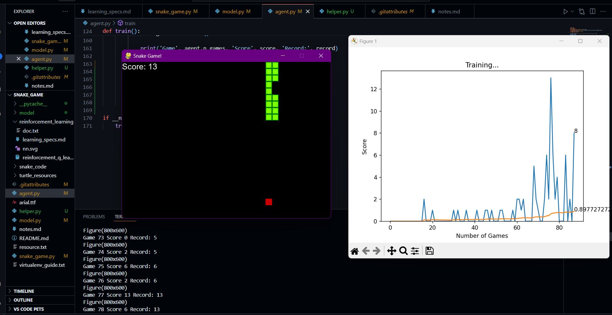

# Some of the key words used:
`pass` statement used in functions to be a placeholder for future code.
When the __pass__ statement is executed, nothing happens, but you avoid getting an error when empty code is not allowed. Empty code is not allowed in loops, function definitions, class definitions, or in if statements.
e.g.:
```py
def func1(x):
    pass
```
# 2/15/24
Checked on features of snake to prevent 180 turn 
- FIXED

# 2/21/24
- Create a game for the agent to play:
    + added reset method to make new game for every death/when exceeding max time
    + added rewards, scores, and such for agent to retrieve info into it system to learn and train
    + added frame_iterations to count if the agent is exceeding the limit for reset
    + action vector for AI to play, a vector-based and involving clock rotation ( think of it like a driving wheel, each of the three vectors to decided if needing to turn right, left, or keep straight)

# 2/24/24
- Reinforcement Learning
- Bellman equation
- Understandin environemtn, percepts, and cognition in the method of building a strategy for the agent to improve in its playing process

# 2/27/24
## Python commenting conventions
In python, we can use these headers as reminders in python to indicate the task to do for this. Some of the comment conventions used are:
- TODO
- NOTE
- FIXME
- OPTIMIZE
- HACK
- BUG
- REFACTOR
- REVIEW
- TEST
- DEPRECATED

```PY
# TODO: Implement this function
def my_function():
    pass

# NOTE: This loop iterates over the list
my_list = [1, 2, 3, 4, 5]
for item in my_list:
    print(item)

# FIXME: This function occasionally returns incorrect results
def buggy_function():
    pass

# OPTIMIZE: Consider using a more efficient algorithm for large datasets
def slow_algorithm():
    pass

# HACK: Temporary fix for issue #1234, refactor later
def workaround():
    pass

# BUG: Division by zero error occurs in certain edge cases
result = 10 / 0  # Division by zero

# REFACTOR: This code can be made more readable by splitting it into smaller functions
def refactor_me():
    pass

# REVIEW: Please review this code for potential improvements
def review_this():
    pass

# TEST: Add additional test cases to cover edge cases
def test_function():
    pass

# DEPRECATED: This feature will be removed in future versions, use new_feature() instead
def old_feature():
    pass
```

## Using markdown in code snippet to even accentuate further

```markdown
# hello
- This is a code snippet in a Markdown file!
```
## Long-term memory, short-term memory

# 3/2/24
Finished with the agent program for now, will go back to set up the trainer for learning

# 5/5/24
